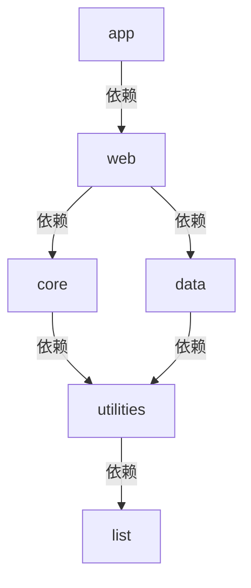

# 应用模块

主应用模块，负责应用启动和配置。

## 主要职责

- Spring Boot 应用启动
- 全局配置管理
- 模块依赖整合

## 重要文件

- `MakeChatApplication.java` - 应用启动类
- `application.yml` - 应用配置文件

## 注意事项

- 这是唯一包含 `@SpringBootApplication` 的模块
- 负责所有模块的依赖注入配置
- 配置文件优先级：环境变量 > application.yml > 默认值

